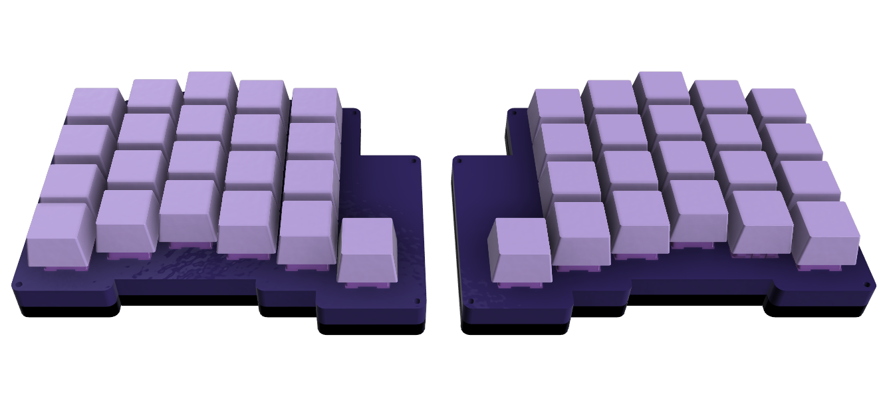

# Split-Keyboard
A split-keyboard made for ergnomic comfort. It has 42 keys, each side having 21. XIAO-nRF5280 is the MCU powering the project because of its wireless support.

## Features

- Wireless
- XIAO-nRF52840 is the MCU.
- 42 keys

## Schematic

You have draw hierarchical sheets and set the sheetname respectly whereas the sheet file should be named the same for both so that whatever symbols you place in one of them are copied into the other without you switching sheets constantly. This wouldnt impact the way footprints are imported into the PCB editor.

### Left Side

### Right Side

## PCB

The source files are in the PCB folder.

## Case

This was made in Fusion, using the PCB as reference. It has cutouts for switches, keys and XIAO ports. The source file can be found in the folder CAD.

### Left

This is the case for the left side of the keyboard.

### Right

This is the case for the right side of the keyboard.

## Firmware

It uses ZMK firmware because of its support for split keyboards. Each controller runs their own firmware but they make it work as a single device. The files are in the firmware folder.

## BOM

| Item | Description | Quantity | Unit Price ($) | Total Price ($) | URL |
| --- | --- |---| --- |--- | --- |
| PCB | PCB | 5 | 3.32 | 16.6 | |
| Seeed Studio XIAO BLE nRF52840 |MCU |2|12.2|24.4|https://robu.in/product/seeed-studio-xiao-ble-nrf52840/ |
| Akko V3 Lavender Purple Pro Switch (Pack of 45)| Keyboard Switches | 1 | 11.65 | 11.65 | https://stackskb.com/store/akko-v3-lavender-purple-pro-switch-pack-of-45/ |
| Veekos Gradient Keycaps (Cherry Profile) (135 keys)| Keycaps | 1 | 13.77 | 13.77 | https://stackskb.com/store/veekos-gradient-keycaps-cherry-profile-135-keys/?attribute_pa_colour=black |
| 1N5819 1W Diode | Diode | 42 | 0.027 | 1.13 | https://robu.in/product/1n5819-1w-diode-pack-of-30/ |
| 0805S8F1005T5E-Royal Ohm-10M 1% 0805 SMD Resistor | Resistor | 4 | 0.0086 | 0.034 | https://robu.in/product/0805s8f1005t5e-royal-ohm-10m-1-0805-smd-resistor/
| Total | | | |67.584| |

## Zine

This was made in Figma. I enjoyed making it kinda.

## Why did I make it?

I made it cause it seemed like a cool project. The routing was tough ngl. Each footprint alligned differently and so many switches and diodes. Its like each project is improving my skills consistently. I now know how to route better (kinda) This was made for [Fallout](fallout.hackclub.com).